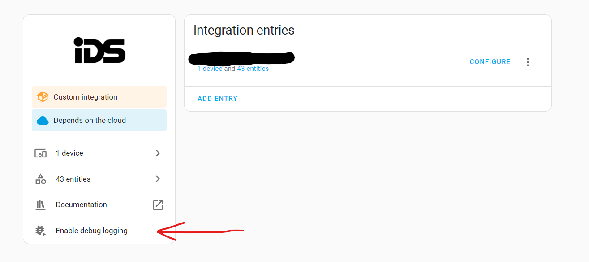

# IDS Hyyp (hawkMod)
IDS Hyyp integration for Home Assistant

**THIS IS A DEBUG BUILD. DON'T USE UNLESS ASKED TO DO SO**

How to use

1. Install debug version via HACS
2. Reboot
3. Go to the integration and click "Enable debug logging". (You may need to refresh the page before the button appears)
4. Let the integration run for 1~2 mins
5. Click "Disable debug logging"
6. Download the text file
7. Sanitize the file. You can do a search and replace with XXXX for example (The file may contain personal information such as email, name, address etc. depending on what you've added into the IDS app)

